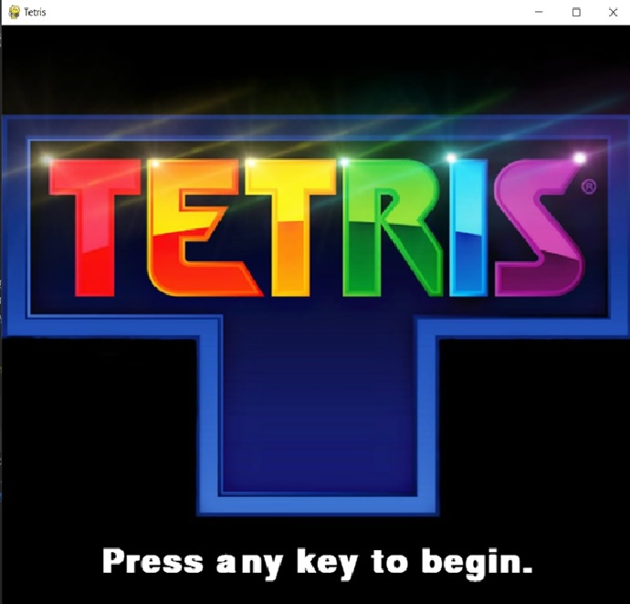
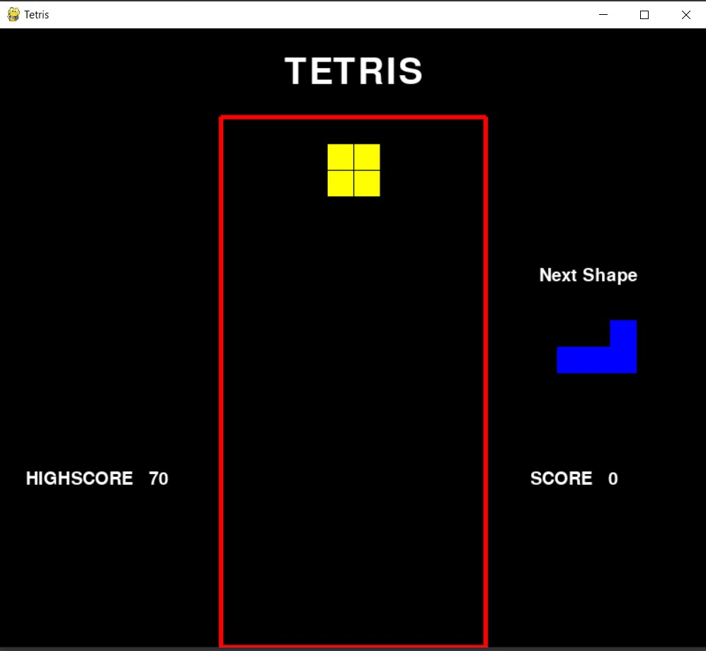

# Tetris Game with Pygame

Dive into the classic world of Tetris with a modern twist! This Tetris game is built using the Pygame library and features sound effects along with a highscore tracker stored in the `highscore.txt` file.

## Features

- **Classic Gameplay:** Experience the timeless fun of Tetris with intuitive controls.
- **Sound Effects:** Enjoy the game with interactive sound effects that enhance the gaming experience.
- **Highscore Tracking:** Compete against yourself by aiming for a highscore. The highest score is stored in the `highscore.txt` file.

## Screenshots




## Getting Started

1. **Prerequisites:**

   Make sure you have Python installed on your system. You'll also need to install the Pygame library. You can install Pygame using the following command:

   ```bash
   pip install pygame
   ```

2. **Clone the Repository:**

   ```bash
   git clone https://github.com/Tejas-Samel/Tetris.git
   ```

3. **Run the Game:**

   Navigate to the project directory and run the `Tetris.py` script:

   ```bash
   cd Tetris
   python Tetris.py
   ```

4. **Controls:**

   - **Arrow Keys:** Move the tetromino left, right, or down.
   - **Up Arrow:** Rotate the tetromino.
   - **Spacebar:** Instantly drop the tetromino to the bottom.

## Highscore Tracking

The highscore is stored in the `highscore.txt` file. Each time you beat the previous highscore, it will be updated in the file.


---
